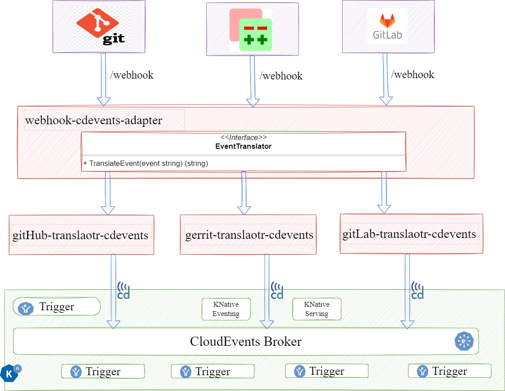

## Webhook CDEvents Adapter

### Overview:
This design describes the approaches to translate events from various Source Code Management (SCM) systems into CDEvents and sending them to configured message-broker, by using a common `webhook_cdevents_adapter`.

A library `webhook_cdevents_adapter` will have an interface that can be implemented for various Source Code Management (SCM) systems like GitHub, Gerrit and Gitlab to translate events into CDEvents format.

Different SCM systems or applications that are exposing events with webhooks can be configured and mapped with the corresponding CDEvent.

For Example configuring Gerrit webhooks and mapping with CDEvents can be found in [gerrit-cdevents](gerrit-cdevents.md) 

### Motivation and Rationale
In establishing the fundamental principles of CDEvents, a key objective is to ensure that events are sent directly from their source or as close to the source as feasible.</br> 
Recognizing the challenge of achieving universal adaptation among all tools and systems to send CDEvents, there arises a need to bridge this gap.</br>
To address this, the `webhook_cdevents_adapter` will be implemented. This is designed to translate and send CDEvents to a message-broker, for various SCM systems.

### Goals

- The SCM translators will be implemented for tools that support sending events over the HTTP protocol with webhook capabilities
- Implement support for one-way translation only; that is, translating events from different SCM systems to CDEvents
- The SCM translators will be implemented to translate only [Source Code Control](https://cdevents.dev/docs/source-code-version-control/) type CDEvents
- Create shared packages/interfaces that will be commonly used for translating and sending CDEvents. 
- Finalize one of the three approaches and utilize the `webhook_cdevents_adapter` library to implement the Gerrit translator initially.

### Non-Goals
- Implement translators for other applications (non-SCM systems) requiring translation to CDEvents
- Translating from CDEvents to other SCM systems events. It is a more complex set up depending on what downstream systems/tools to support
- Implementing translators for tools that support sending events other than HTTP protocol (like over ssh)

### Design
Based on the initial design discussion, we have identified three different approaches to creating the `webhook_cdevents_adapter` library. Each approach has its own pros and cons, and we need to choose the most suitable one.

### Approach 1 : Creating a Web Service with Libraries/Packages for different SCM translators
A Golang main application `webhook_cdevents_adapter` will be created to expose the translation functionality as a web service with HTTP/REST API server.</br>
SCM systems webhooks/endpoints are registered to handle the translation of the events into CDEvents.</br>
An interface `EventTranslator` will be created to handle `TranslateEvent` and this needs to be implemented by different translators.

- Example structure of `webhook_cdevents_adapter` application
````go
package main

type EventTranslator interface {
	TranslateEvent()
}

func main() {
  
   // Register translators in the main application
   http.HandleFunc("/translate/gerrit-webhooks", gerrittranslator.TranslateEvent)
   http.HandleFunc("/translate/github-webhooks", githubtranslator.TranslateEvent)

   // Start the main application's HTTP server on port 8080
   http.ListenAndServe(":8080", nil)
}
````
#### Create a Library/Package gerrit-translator-cdevents
Library with the name `gerrit-translator-cdevents` will be created in a separate package/repo.</br>
Declare a struct to hold fields related to translation of Gerrit event.</br>
Implement `TranslateEvent` to translate Gerrit event to CDEvent.

- Example structure of `gerrit-translator-cdevents` library
````go
package gerrittranslator


type GerritTranslator struct {
   // Fields for Gerrit event Translator
}

func (translator *GerritTranslator) TranslateEvent(req *http.Request) (CDEvent, error) {
	// handle translate Gerrit event to CDEvent
}
````

#### Pros and Cons
- This structure can be extended by adding more translator libraries/Packages in the future.
- The problem with this approach anyone who is wanting some custom set of translator would need to write their own main class.

### Approach 2 : Using Go plugins to implement different Translators
Plugins are Go interface implementations that can be compiled and loaded during the runtime of a Go program using Go's [plugin](https://pkg.go.dev/plugin) package

#### Create a shared interface
Define an interface `EventTranslator` that represents the common functionality to `TranslateEvent` and expected to implement from all translator plugins.

- Example structure of `webhook_cdevents_adapter` interface
````go
package cdeventstranslator

type EventTranslator interface {
	TranslateEvent()
}
````

#### Implement gerrit-translator-cdevents plugin
Plugin with the name `gerrit-translator-cdevents` will be created in a separate repo.</br>
GerritTranslator needs to implement the `cdeventstranslator.EventTranslator` interface to handle the translation from Gerrit event to CDEvent.</br>
Build the `gerrit-translator-cdevents` plugin as shared object using `go build -buildmode=plugin`, so that the plugin can be loaded/used from other Golang main application to `TranslateEvent` using Go's [plugin](https://pkg.go.dev/plugin) package.

- Example structure of `gerrit-translator-cdevents` plugin
````go
package main


type GerritTranslator struct {
   // Fields for Gerrit event Translator
}

func (translator *GerritTranslator) TranslateEvent(event string) {
	// handle translate Gerrit event to CDEvent
}

func main() {
	// Create an instance of the GerritTranslator
	translator := &GerritTranslator{}
  
}
````

#### Pros and Cons

- This structure can be extended by adding more translator plugins in the future without having to recompile the entire application.
- The Go plugin system is currently only supported on Unix-like systems and has some limitations, such as the need to compile everything with the same Go version.
- Expose the functionality of Go translator plugins as an HTTP/REST API, if this needs be used from other languages.


### Approach 3 : Using RPC to add new Translators
 
HashiCorp's [`go-plugin`](https://github.com/hashicorp/go-plugin) library simplifies the implementation of a plugin system in Go, It is a Go (golang) plugin system over RPC created by HashiCorp.</br>
gRPC is a high-performance RPC (Remote Procedure Call) framework developed by Google under Mozilla Public License.

gRPC-based plugins with HashiCorp's go-plugin library will help to enable communication between the main Go application (the server) and different translator plugins (the clients) using the gRPC framework.

As per the HashiCorp's `go-plugin` library [usage documentation](https://github.com/hashicorp/go-plugin/tree/main?tab=readme-ov-file#usage) the translator services can be implemented as below,

#### Create a shared interface
Define an interface `EventTranslator` that represents the common functionality to `TranslateEvent` and will be exposed for plugins to implement.</br>
Different translator plugins can be implemented that communicates over a gRPC connection.

- Example structure of `webhook_cdevents_adapter` interface
````go
package cdeventstranslator

type EventTranslator interface {
	TranslateEvent()
}
````

#### Implement gerrit-translator-cdevents plugin
Plugin with the name `gerrit-translator-cdevents` will be created in a separate repo/package.</br>
GerritTranslator needs to implement the `cdeventstranslator.EventTranslator` interface to handle the translation from Gerrit event to CDEvent and that communicates over a gRPC connection.</br>
Call `plugin.Serve` to serve a plugin from the main function to GRPC server using hashicorp's go-plugin

Build the `gerrit-translator-cdevents` plugin using `go build`, so that the plugin can be loaded/used from other Golang main application to `TranslateEvent`

- Example structure of `gerrit-translator-cdevents` plugin:
````go
package main


type GerritTranslator struct {
   // Fields for Gerrit event Translator
}

func (translator *GerritTranslator) TranslateEvent(event string) {
	// handle translate Gerrit event to CDEvent
}

func main() {
	// using hashicorp's plugin
	plugin.Serve(&plugin.ServeConfig{
		.....

		GRPCServer: plugin.DefaultGRPCServer,
	})
  
}
````
#### GRPC client and server implementations using protocol buffers
Creating GRPC Client and Server implementations is a common template that can be generated 
by using [Buf CLI's](https://buf.build/docs/generate/tutorial) `buf generate` command</br>
That generates Go code from [protocol buffers](https://protobuf.dev/getting-started/gotutorial/) files(.proto) using Go plugin `protoc-gen-go-grpc`.

- Example structure of `webhook_cdevents_adapter` proto file
````proto
// cdevents_translator.proto

syntax = "proto3";
package proto;
option go_package = "./proto";

message TranslateRequest {
  string text = 1;
}

message TranslateResponse {
  string result = 1;
}

message Empty {}

service EventTranslator {
  rpc TranslateEvent (TranslateRequest) returns (TranslateResponse);
}
````

The GRPC client/server will help to handle `EventTranslator` service request/response over GRPC by using the proto generated files.

````go
package cdeventstranslator

type GRPCClient struct {
   // init client
}

func (m *GRPCClient) TranslateEvent(event string) error {
	_, err := m.client.TranslateEvent(context.Background(), &proto.TranslateRequest{Event: event})
	return err
}

type GRPCServer struct {
	// init server
}

func (m *GRPCServer) TranslateEvent(ctx context.Context, req *proto.TranslateRequest) (*proto.Empty, error) {
	return &proto.Empty{}, m.Impl.TranslateEvent(req.Event)
}

````

The GRPC client/server implementations can be [generated in other languages](https://protobuf.dev/getting-started/), to enable Cross-language support for Plugins implemented.</br>
Plugin users use `plugin.Client` to launch a subprocess and request an interface implementation using hashicorp's go-plugin over RPC.</br>
More detailed implementation can be referred from HashiCorp's go-plugin [gRPC examples](https://github.com/hashicorp/go-plugin/tree/main/examples/grpc) 

#### Pros and Cons
- This structure allows you to have a main application that dynamically loads and communicates with different translator plugins over gRPC.

### Proposed Architecture
- Various SCM systems can be configured to send events through webhook
- The event as raw payload will be received by `webhook_cdevents_adapter`
- `webhook_cdevents_adapter` defines an interface, that can be implemented by various SCM systems to translate and send the event.
- The event received will be mapped and translated to a specific CDEvent type.
- Then the CDEvent will be send to configured message-broker



### Known Unknowns
- Creating CDEvents from other type of events from SDK and sending them to configured Message-broker using CloudEvent library, can be implemented in a shared package.
- Having a main application for Approach 2 and 3 from `webhook_cdevents_adapter` or maintained by user of the translator.
- This `webhook_cdevents_adapter` can be extended to implement for Non SCM tools too.


### Conclusion
Based on the discussion deciding to implement `webhook_cdevents_adapter` with  Approach 3 : Using RPC to add new Translators